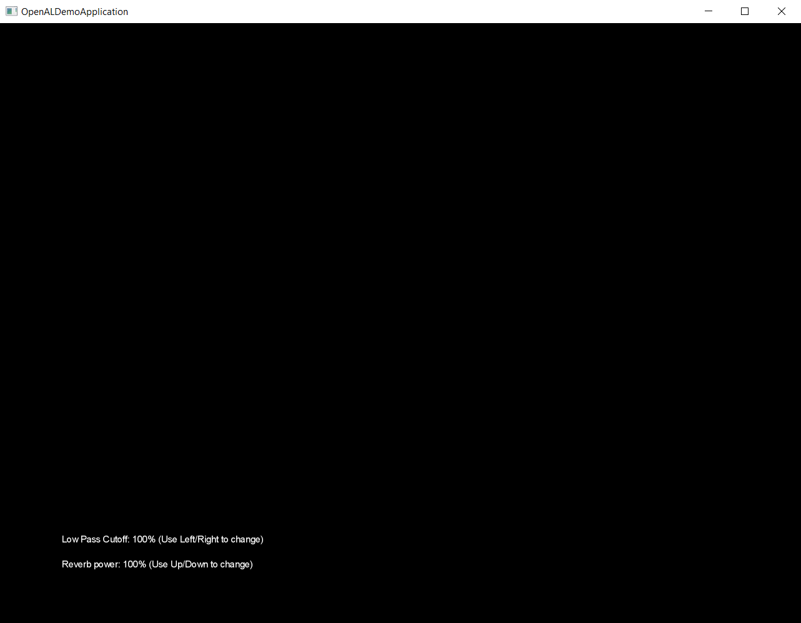

# libgdx-openal-reverb-demo

Demo showing OpenAL reverb working with libgdx and lwjgl3,
based on example code from [abvadabra/libgdx-audio-effects](https://github.com/abvadabra/libgdx-audio-effects)
and [LWJGL/lwjgl3](https://github.com/LWJGL/lwjgl3/).

# FAQ

## This isn't actually a working project!

Nope, it's just the relevant code, too big for a Gist, and I don't have the time right now to put all
the libgdx stuff around it to demo it.

Perhaps in the future there might be a better, cleaned up repo with 
an actual working demo.

## What platforms does this work on?

I've only tested it on Windows.

## What does it look like when it's working?

